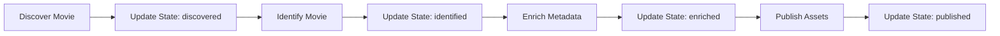
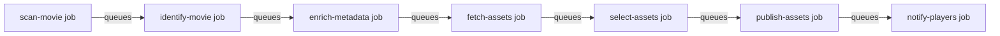

# Job Queue Migration Strategy

## Executive Summary

This document outlines the migration from state-based tracking to a pure job-driven architecture, following industry best practices used by Netflix, YouTube, and Spotify for media processing pipelines.

**Key Principle**: The job queue IS the state machine. Database stores facts, not states.

---

## Table of Contents

1. [Architecture Overview](#architecture-overview)
2. [Industry Pattern: Event-Driven Job Chains](#industry-pattern-event-driven-job-chains)
3. [Implementation Strategy](#implementation-strategy)
4. [Storage Abstraction Layer](#storage-abstraction-layer)
5. [Frontend Implications](#frontend-implications)
6. [WebSocket Events](#websocket-events)
7. [Testing Strategy](#testing-strategy)
8. [Migration Timeline](#migration-timeline)
9. [Rollback Plan](#rollback-plan)

---

## Architecture Overview

### Current State (State-Based)



**Problems**:
- State synchronization bugs
- Race conditions
- Difficult retry logic
- Poor observability

### Target State (Job-Driven)



**Benefits**:
- No state synchronization needed
- Natural retry with exponential backoff
- Perfect audit trail
- Easy to add/remove steps
- Scalable (add more workers)

---

## Industry Pattern: Event-Driven Job Chains

### How Netflix Processes Media

Netflix uses AWS Step Functions and SQS for their media pipeline:

```typescript
// Netflix-style job definition
interface MediaJob {
    id: string;
    type: 'analyze' | 'transcode' | 'quality-check' | 'publish';
    entityId: string;
    priority: number;
    metadata: {
        resolution?: string;
        bitrate?: number;
        codec?: string;
    };
    dependencies: string[];  // Job IDs that must complete first
    createdAt: Date;
    scheduledFor: Date;
    attempts: number;
    maxAttempts: number;
}
```

### Spotify's Processing Model

Spotify processes millions of tracks using Google Cloud Tasks:

1. **Ingest**: Audio file uploaded
2. **Analyze**: Extract audio features
3. **Transcode**: Create multiple quality versions
4. **Distribute**: Push to CDN edge nodes
5. **Index**: Update search indices

Each step is a separate job that queues the next on success.

### YouTube's Video Pipeline

YouTube processes 500 hours of video per minute:

1. **Upload job** → validates file
2. **Transcode job** → creates multiple resolutions
3. **Thumbnail job** → generates preview images
4. **ML analysis job** → content classification
5. **Distribution job** → copies to CDN
6. **Index job** → updates search

**Key Pattern**: Each job is idempotent and can be retried safely.

---

## Implementation Strategy

### Phase 1: Job Chaining (Keep SQLite)

**Timeline**: 1 sprint (2 weeks)
**Risk**: Low
**Rollback**: Easy (keep state columns, just don't update them)

#### 1.1 Modify Job Handlers

```typescript
// Before: Handler completes without chaining
class JobHandlers {
    private async handleEnrichMetadata(job: Job): Promise<void> {
        const { movieId } = job.payload;
        const metadata = await this.tmdbService.fetchMetadata(movieId);
        await this.movieService.updateMetadata(movieId, metadata);
        // Job ends here
    }
}

// After: Handler queues next job
class JobHandlers {
    private async handleEnrichMetadata(job: Job): Promise<void> {
        const { movieId } = job.payload;

        // Check if monitored (respect user control)
        const movie = await this.movieService.getMovie(movieId);
        if (!movie.monitored) {
            logger.info(`Movie ${movieId} is unmonitored, stopping chain`);
            return;
        }

        try {
            // Do the work
            const metadata = await this.tmdbService.fetchMetadata(movieId);
            await this.movieService.updateMetadata(movieId, metadata);

            // Success: Queue next job(s)
            await this.jobQueue.add('fetch-assets', {
                movieId,
                tmdbId: metadata.tmdbId,
                priority: job.priority  // Inherit priority
            });

            // Can queue multiple parallel jobs
            await this.jobQueue.add('fetch-subtitles', {
                movieId,
                imdbId: metadata.imdbId,
                priority: job.priority + 1  // Lower priority
            });

        } catch (error) {
            // Let job queue handle retry
            throw error;
        }
    }
}
```

#### 1.2 Job Flow Definition

```typescript
// Define the complete job flow
const JOB_FLOW = {
    'scan-movie': {
        handler: 'handleScanMovie',
        nextJobs: ['identify-movie'],
        retryable: true,
        maxAttempts: 3,
        backoffMs: 1000
    },
    'identify-movie': {
        handler: 'handleIdentifyMovie',
        nextJobs: ['enrich-metadata'],
        retryable: true,
        maxAttempts: 5,
        backoffMs: 5000
    },
    'enrich-metadata': {
        handler: 'handleEnrichMetadata',
        nextJobs: ['fetch-assets', 'fetch-subtitles'],
        retryable: true,
        maxAttempts: 3,
        backoffMs: 10000
    },
    'fetch-assets': {
        handler: 'handleFetchAssets',
        nextJobs: ['select-assets'],
        retryable: true,
        maxAttempts: 3,
        backoffMs: 5000
    },
    'select-assets': {
        handler: 'handleSelectAssets',
        nextJobs: ['publish-assets'],
        retryable: false,  // Deterministic, no retry needed
        maxAttempts: 1
    },
    'publish-assets': {
        handler: 'handlePublishAssets',
        nextJobs: ['notify-players'],
        retryable: true,
        maxAttempts: 3,
        backoffMs: 2000
    },
    'notify-players': {
        handler: 'handleNotifyPlayers',
        nextJobs: [],  // End of chain
        retryable: true,
        maxAttempts: 5,
        backoffMs: 30000
    }
};
```

### Phase 2: Remove State Tracking

**Timeline**: 1 week
**Risk**: Medium
**Rollback**: Re-add state update calls

#### 2.1 Database Changes

```sql
-- Current schema (keep for now, stop updating)
CREATE TABLE movies (
    identification_status TEXT,  -- Stop updating this
    processing_state TEXT,       -- Stop updating this

    -- Facts we continue to update
    tmdb_id TEXT,
    identified_at TIMESTAMP,
    last_enriched_at TIMESTAMP,
    poster_cache_id TEXT,
    monitored BOOLEAN DEFAULT 1
);

-- Future schema (after validation)
CREATE TABLE movies (
    -- Remove state columns
    -- Keep only facts
    tmdb_id TEXT,
    identified_at TIMESTAMP,
    last_enriched_at TIMESTAMP,
    poster_cache_id TEXT,
    monitored BOOLEAN DEFAULT 1
);
```

#### 2.2 Status Derivation

```typescript
class MovieService {
    async getMovieStatus(movieId: number): Promise<MovieStatus> {
        // 1. Check job queue for active/pending jobs
        const jobs = await this.jobQueue.getJobsForEntity('movie', movieId);

        const activeJob = jobs.find(j => j.status === 'active');
        if (activeJob) {
            return {
                status: 'processing',
                activity: this.describeJob(activeJob),
                progress: activeJob.progress || 0
            };
        }

        const pendingJob = jobs.find(j => j.status === 'pending');
        if (pendingJob) {
            return {
                status: 'queued',
                position: await this.jobQueue.getQueuePosition(pendingJob.id),
                estimatedTime: this.estimateProcessingTime(pendingJob)
            };
        }

        const failedJob = jobs.find(j =>
            j.status === 'failed' &&
            j.attempts < j.maxAttempts
        );
        if (failedJob) {
            return {
                status: 'retrying',
                lastError: failedJob.error,
                nextRetry: new Date(failedJob.scheduledFor),
                attempt: `${failedJob.attempts}/${failedJob.maxAttempts}`
            };
        }

        // 2. Check facts in database
        const movie = await this.getMovie(movieId);

        if (!movie.monitored) {
            return { status: 'unmonitored' };
        }

        if (!movie.tmdb_id) {
            return { status: 'needs-identification' };
        }

        if (!movie.poster_cache_id || !movie.fanart_cache_id) {
            return { status: 'missing-assets' };
        }

        const daysSinceEnriched =
            (Date.now() - movie.last_enriched_at.getTime()) / 86400000;

        if (daysSinceEnriched > 30) {
            return { status: 'stale', lastUpdated: movie.last_enriched_at };
        }

        return { status: 'ready', lastUpdated: movie.last_enriched_at };
    }

    private describeJob(job: Job): string {
        const descriptions: Record<string, string> = {
            'scan-movie': 'Scanning file information',
            'identify-movie': 'Identifying with online databases',
            'enrich-metadata': 'Fetching metadata',
            'fetch-assets': 'Downloading artwork',
            'select-assets': 'Selecting best quality assets',
            'publish-assets': 'Publishing to library',
            'notify-players': 'Updating media players'
        };
        return descriptions[job.type] || 'Processing';
    }
}
```

---

## Storage Abstraction Layer

### Interface Design (Start Here)

```typescript
// src/services/jobQueue/IJobQueueStorage.ts
export interface IJobQueueStorage {
    // Core operations
    addJob(job: JobData): Promise<number>;
    getJob(id: number): Promise<Job | null>;
    updateJob(id: number, updates: Partial<Job>): Promise<void>;
    deleteJob(id: number): Promise<void>;

    // Queue operations
    getNextJob(): Promise<Job | null>;
    getJobsByStatus(status: JobStatus): Promise<Job[]>;
    getJobsByEntity(entityType: string, entityId: number): Promise<Job[]>;

    // Bulk operations
    getJobs(filter: JobFilter): Promise<Job[]>;
    updateBulk(filter: JobFilter, updates: Partial<Job>): Promise<number>;

    // Maintenance
    cleanupOldJobs(beforeDate: Date): Promise<number>;
    getStats(): Promise<JobQueueStats>;

    // Connection management
    connect(): Promise<void>;
    disconnect(): Promise<void>;
    isHealthy(): Promise<boolean>;
}

export interface JobData {
    type: string;
    payload: any;
    priority: number;
    scheduledFor?: Date;
    dependencies?: number[];
    maxAttempts?: number;
    backoffMs?: number;
}

export interface Job extends JobData {
    id: number;
    status: 'pending' | 'active' | 'completed' | 'failed';
    attempts: number;
    progress?: number;
    error?: string;
    createdAt: Date;
    startedAt?: Date;
    completedAt?: Date;
    workerId?: string;
}
```

### SQLite Implementation (Current/Fallback)

```typescript
// src/services/jobQueue/SqliteJobQueueStorage.ts
import { Database } from 'sqlite3';
import { IJobQueueStorage, Job, JobData } from './IJobQueueStorage';

export class SqliteJobQueueStorage implements IJobQueueStorage {
    private db: Database;

    constructor(private dbPath: string = './data/metarr.sqlite') {}

    async connect(): Promise<void> {
        this.db = new Database(this.dbPath);
        await this.ensureSchema();
    }

    private async ensureSchema(): Promise<void> {
        await this.db.exec(`
            CREATE TABLE IF NOT EXISTS job_queue (
                id INTEGER PRIMARY KEY AUTOINCREMENT,
                type TEXT NOT NULL,
                payload TEXT NOT NULL,
                status TEXT DEFAULT 'pending',
                priority INTEGER DEFAULT 5,
                attempts INTEGER DEFAULT 0,
                max_attempts INTEGER DEFAULT 3,
                backoff_ms INTEGER DEFAULT 1000,
                progress REAL DEFAULT 0,
                error TEXT,
                scheduled_for TIMESTAMP DEFAULT CURRENT_TIMESTAMP,
                created_at TIMESTAMP DEFAULT CURRENT_TIMESTAMP,
                started_at TIMESTAMP,
                completed_at TIMESTAMP,
                worker_id TEXT,
                CHECK(status IN ('pending', 'active', 'completed', 'failed'))
            );

            CREATE INDEX IF NOT EXISTS idx_job_queue_next ON job_queue(
                status, priority DESC, scheduled_for ASC
            ) WHERE status = 'pending';

            CREATE INDEX IF NOT EXISTS idx_job_queue_entity ON job_queue(
                type, payload
            );
        `);
    }

    async addJob(job: JobData): Promise<number> {
        const result = await this.db.run(`
            INSERT INTO job_queue (
                type, payload, priority, scheduled_for, max_attempts, backoff_ms
            ) VALUES (?, ?, ?, ?, ?, ?)
        `, [
            job.type,
            JSON.stringify(job.payload),
            job.priority || 5,
            job.scheduledFor || new Date(),
            job.maxAttempts || 3,
            job.backoffMs || 1000
        ]);
        return result.lastID;
    }

    async getNextJob(): Promise<Job | null> {
        // Atomic job claim using UPDATE with RETURNING (SQLite 3.35+)
        const row = await this.db.get(`
            UPDATE job_queue
            SET status = 'active',
                started_at = CURRENT_TIMESTAMP,
                worker_id = ?
            WHERE id = (
                SELECT id FROM job_queue
                WHERE status = 'pending'
                  AND scheduled_for <= CURRENT_TIMESTAMP
                ORDER BY priority DESC, scheduled_for ASC
                LIMIT 1
            )
            RETURNING *
        `, [process.pid]);

        return row ? this.rowToJob(row) : null;
    }

    private rowToJob(row: any): Job {
        return {
            id: row.id,
            type: row.type,
            payload: JSON.parse(row.payload),
            status: row.status,
            priority: row.priority,
            attempts: row.attempts,
            maxAttempts: row.max_attempts,
            backoffMs: row.backoff_ms,
            progress: row.progress,
            error: row.error,
            createdAt: new Date(row.created_at),
            startedAt: row.started_at ? new Date(row.started_at) : undefined,
            completedAt: row.completed_at ? new Date(row.completed_at) : undefined,
            workerId: row.worker_id
        };
    }

    async isHealthy(): Promise<boolean> {
        try {
            await this.db.get('SELECT 1');
            return true;
        } catch {
            return false;
        }
    }
}
```

### Redis Implementation (Future Primary)

```typescript
// src/services/jobQueue/RedisJobQueueStorage.ts
import Bull from 'bull';
import { IJobQueueStorage, Job, JobData } from './IJobQueueStorage';

export class RedisJobQueueStorage implements IJobQueueStorage {
    private queues: Map<string, Bull.Queue> = new Map();
    private defaultQueue: Bull.Queue;

    constructor(private redisUrl: string) {}

    async connect(): Promise<void> {
        // Create default queue
        this.defaultQueue = new Bull('metarr', this.redisUrl, {
            defaultJobOptions: {
                removeOnComplete: false,  // Keep for status derivation
                removeOnFail: false
            }
        });

        // Create priority queues for different job types
        const priorities = {
            'webhook': 1,
            'user-action': 2,
            'scheduled': 5,
            'background': 10
        };

        for (const [name, priority] of Object.entries(priorities)) {
            const queue = new Bull(`metarr-${name}`, this.redisUrl, {
                defaultJobOptions: {
                    priority,
                    attempts: 3,
                    backoff: {
                        type: 'exponential',
                        delay: 1000
                    }
                }
            });
            this.queues.set(name, queue);
        }
    }

    async addJob(job: JobData): Promise<number> {
        // Determine which queue based on job type
        const queueName = this.getQueueName(job);
        const queue = this.queues.get(queueName) || this.defaultQueue;

        const bullJob = await queue.add(job.type, job.payload, {
            priority: job.priority,
            delay: job.scheduledFor ?
                job.scheduledFor.getTime() - Date.now() : 0,
            attempts: job.maxAttempts || 3,
            backoff: {
                type: 'exponential',
                delay: job.backoffMs || 1000
            }
        });

        return parseInt(bullJob.id as string);
    }

    async getJob(id: number): Promise<Job | null> {
        // Search across all queues
        for (const queue of this.queues.values()) {
            const bullJob = await queue.getJob(id.toString());
            if (bullJob) {
                return this.bullJobToJob(bullJob);
            }
        }
        return null;
    }

    private bullJobToJob(bullJob: Bull.Job): Job {
        return {
            id: parseInt(bullJob.id as string),
            type: bullJob.name,
            payload: bullJob.data,
            status: this.mapBullStatus(bullJob),
            priority: bullJob.opts.priority || 5,
            attempts: bullJob.attemptsMade,
            maxAttempts: bullJob.opts.attempts || 3,
            progress: bullJob.progress(),
            error: bullJob.failedReason,
            createdAt: new Date(bullJob.timestamp),
            startedAt: bullJob.processedOn ? new Date(bullJob.processedOn) : undefined,
            completedAt: bullJob.finishedOn ? new Date(bullJob.finishedOn) : undefined
        };
    }

    private mapBullStatus(job: Bull.Job): Job['status'] {
        if (await job.isCompleted()) return 'completed';
        if (await job.isFailed()) return 'failed';
        if (await job.isActive()) return 'active';
        return 'pending';
    }

    async isHealthy(): Promise<boolean> {
        try {
            await this.defaultQueue.isReady();
            return true;
        } catch {
            return false;
        }
    }
}
```

### Storage Factory

```typescript
// src/services/jobQueue/JobQueueStorageFactory.ts
import { IJobQueueStorage } from './IJobQueueStorage';
import { SqliteJobQueueStorage } from './SqliteJobQueueStorage';
import { RedisJobQueueStorage } from './RedisJobQueueStorage';
import { logger } from '../../utils/logger';

export class JobQueueStorageFactory {
    static async create(): Promise<IJobQueueStorage> {
        const redisUrl = process.env.REDIS_URL;

        if (redisUrl) {
            try {
                logger.info('Attempting to connect to Redis for job queue');
                const storage = new RedisJobQueueStorage(redisUrl);
                await storage.connect();

                // Test connection
                if (await storage.isHealthy()) {
                    logger.info('Successfully connected to Redis job queue');
                    return storage;
                }
            } catch (error) {
                logger.warn('Failed to connect to Redis, falling back to SQLite', error);
            }
        }

        // Fallback to SQLite
        logger.info('Using SQLite for job queue storage');
        const storage = new SqliteJobQueueStorage();
        await storage.connect();
        return storage;
    }
}
```

### Modified JobQueueService

```typescript
// src/services/jobQueue/JobQueueService.ts
export class JobQueueService {
    private storage: IJobQueueStorage;
    private handlers: Map<string, JobHandler> = new Map();
    private isProcessing = false;

    constructor(storage?: IJobQueueStorage) {
        // Storage will be injected or created by factory
        this.storage = storage;
    }

    async initialize(): Promise<void> {
        if (!this.storage) {
            this.storage = await JobQueueStorageFactory.create();
        }

        // Start processing loop
        this.startProcessing();
    }

    async add(type: string, payload: any, options?: JobOptions): Promise<number> {
        const jobId = await this.storage.addJob({
            type,
            payload,
            priority: options?.priority || this.getDefaultPriority(type),
            scheduledFor: options?.scheduledFor,
            maxAttempts: options?.maxAttempts,
            backoffMs: options?.backoffMs
        });

        // Emit WebSocket event
        this.emitJobQueued(jobId, type, payload);

        return jobId;
    }

    private getDefaultPriority(type: string): number {
        const priorities: Record<string, number> = {
            'webhook-received': 1,
            'user-action': 2,
            'enrich-metadata': 5,
            'fetch-assets': 6,
            'scheduled-scan': 8,
            'cleanup': 10
        };
        return priorities[type] || 5;
    }
}
```

---

## Frontend Implications

### Status Display Strategy

```typescript
// src/components/MovieStatus.tsx
import { useQuery } from '@tanstack/react-query';
import { movieApi } from '../api/movieApi';

interface MovieStatusProps {
    movieId: number;
}

export function MovieStatus({ movieId }: MovieStatusProps) {
    // Poll status every 2 seconds when processing
    const { data: status, isLoading } = useQuery({
        queryKey: ['movie-status', movieId],
        queryFn: () => movieApi.getStatus(movieId),
        refetchInterval: (data) => {
            // Poll frequently when processing
            if (data?.status === 'processing' || data?.status === 'queued') {
                return 2000;
            }
            // Poll occasionally when idle
            return 60000;
        }
    });

    if (isLoading) return <Spinner />;

    switch (status.status) {
        case 'processing':
            return (
                <Badge variant="animated" color="blue">
                    <LoadingIcon className="animate-spin" />
                    {status.activity}
                    {status.progress && (
                        <ProgressBar value={status.progress} max={100} />
                    )}
                </Badge>
            );

        case 'queued':
            return (
                <Badge variant="subtle" color="yellow">
                    Queued (Position: {status.position})
                </Badge>
            );

        case 'retrying':
            return (
                <Badge variant="outline" color="orange">
                    Retry {status.attempt} at {formatTime(status.nextRetry)}
                </Badge>
            );

        case 'unmonitored':
            return (
                <Badge variant="solid" color="gray">
                    <LockIcon />
                    Manual Control
                </Badge>
            );

        case 'needs-identification':
            return (
                <Badge variant="outline" color="red">
                    Needs ID
                    <Button size="xs" onClick={() => identifyMovie(movieId)}>
                        Fix
                    </Button>
                </Badge>
            );

        case 'ready':
            return (
                <Badge variant="solid" color="green">
                    <CheckIcon />
                    Ready
                    {status.lastUpdated && (
                        <Tooltip content={`Updated ${formatDate(status.lastUpdated)}`}>
                            <InfoIcon />
                        </Tooltip>
                    )}
                </Badge>
            );

        default:
            return null;
    }
}
```

### React Query Integration

```typescript
// src/hooks/useMovieJobs.ts
export function useMovieJobs(movieId: number) {
    const queryClient = useQueryClient();

    // Subscribe to WebSocket events for this movie
    useEffect(() => {
        const unsubscribe = websocket.subscribe(
            `movie:${movieId}:job`,
            (event) => {
                // Invalidate status query when job updates
                queryClient.invalidateQueries(['movie-status', movieId]);

                // Update job list if viewing job history
                queryClient.setQueryData(
                    ['movie-jobs', movieId],
                    (old: Job[]) => {
                        const index = old.findIndex(j => j.id === event.jobId);
                        if (index >= 0) {
                            const updated = [...old];
                            updated[index] = event.job;
                            return updated;
                        }
                        return [event.job, ...old];
                    }
                );
            }
        );

        return unsubscribe;
    }, [movieId, queryClient]);

    return useQuery({
        queryKey: ['movie-jobs', movieId],
        queryFn: () => jobApi.getJobsForEntity('movie', movieId)
    });
}
```

### Bulk Operations UI

```typescript
// src/components/BulkActions.tsx
export function BulkActions({ selectedMovies }: { selectedMovies: number[] }) {
    const [isProcessing, setIsProcessing] = useState(false);
    const queryClient = useQueryClient();

    const enrichSelected = async () => {
        setIsProcessing(true);

        // Queue jobs for all selected movies
        const jobIds = await Promise.all(
            selectedMovies.map(movieId =>
                jobApi.queueJob('enrich-metadata', { movieId })
            )
        );

        // Show notification with job count
        toast.success(`Queued ${jobIds.length} enrichment jobs`);

        // Invalidate status for all selected
        selectedMovies.forEach(movieId => {
            queryClient.invalidateQueries(['movie-status', movieId]);
        });

        setIsProcessing(false);
    };

    return (
        <div className="flex gap-2">
            <Button
                onClick={enrichSelected}
                disabled={isProcessing || selectedMovies.length === 0}
            >
                Enrich Selected ({selectedMovies.length})
            </Button>
        </div>
    );
}
```

---

## WebSocket Events

### Event Definitions

```typescript
// src/types/websocket.ts
export interface JobQueuedEvent {
    type: 'job:queued';
    jobId: number;
    jobType: string;
    entityType: 'movie' | 'series' | 'episode';
    entityId: number;
    priority: number;
    position?: number;
}

export interface JobStartedEvent {
    type: 'job:started';
    jobId: number;
    jobType: string;
    entityType: 'movie' | 'series' | 'episode';
    entityId: number;
    workerId: string;
}

export interface JobProgressEvent {
    type: 'job:progress';
    jobId: number;
    entityType: 'movie' | 'series' | 'episode';
    entityId: number;
    progress: number;  // 0-100
    message?: string;  // "Downloading poster (2.3 MB)"
}

export interface JobCompletedEvent {
    type: 'job:completed';
    jobId: number;
    jobType: string;
    entityType: 'movie' | 'series' | 'episode';
    entityId: number;
    result?: any;
}

export interface JobFailedEvent {
    type: 'job:failed';
    jobId: number;
    jobType: string;
    entityType: 'movie' | 'series' | 'episode';
    entityId: number;
    error: string;
    willRetry: boolean;
    nextRetryAt?: Date;
    attempt: number;
    maxAttempts: number;
}

export interface JobChainCompletedEvent {
    type: 'job:chain:completed';
    entityType: 'movie' | 'series' | 'episode';
    entityId: number;
    duration: number;  // milliseconds
    jobCount: number;
}

export interface QueueStatsEvent {
    type: 'queue:stats';
    pending: number;
    active: number;
    completed: number;
    failed: number;
    workers: number;
    throughput: number;  // jobs/minute
}
```

### Server-Side Event Emission

```typescript
// src/services/jobQueue/JobEventEmitter.ts
export class JobEventEmitter {
    constructor(
        private websocket: WebSocketBroadcaster,
        private jobQueue: JobQueueService
    ) {
        this.attachListeners();
    }

    private attachListeners() {
        this.jobQueue.on('job:queued', (job: Job) => {
            this.websocket.broadcast({
                type: 'job:queued',
                jobId: job.id,
                jobType: job.type,
                entityType: this.extractEntityType(job),
                entityId: this.extractEntityId(job),
                priority: job.priority,
                position: this.jobQueue.getQueuePosition(job.id)
            });
        });

        this.jobQueue.on('job:started', (job: Job) => {
            this.websocket.broadcast({
                type: 'job:started',
                jobId: job.id,
                jobType: job.type,
                entityType: this.extractEntityType(job),
                entityId: this.extractEntityId(job),
                workerId: job.workerId
            });
        });

        this.jobQueue.on('job:progress', (job: Job, progress: number) => {
            this.websocket.broadcast({
                type: 'job:progress',
                jobId: job.id,
                entityType: this.extractEntityType(job),
                entityId: this.extractEntityId(job),
                progress,
                message: this.getProgressMessage(job, progress)
            });
        });

        this.jobQueue.on('job:completed', (job: Job) => {
            this.websocket.broadcast({
                type: 'job:completed',
                jobId: job.id,
                jobType: job.type,
                entityType: this.extractEntityType(job),
                entityId: this.extractEntityId(job),
                result: job.result
            });

            // Check if this completes a chain
            this.checkChainCompletion(job);
        });

        this.jobQueue.on('job:failed', (job: Job, error: Error) => {
            const willRetry = job.attempts < job.maxAttempts;
            const nextRetryAt = willRetry ?
                new Date(Date.now() + this.calculateBackoff(job)) : null;

            this.websocket.broadcast({
                type: 'job:failed',
                jobId: job.id,
                jobType: job.type,
                entityType: this.extractEntityType(job),
                entityId: this.extractEntityId(job),
                error: error.message,
                willRetry,
                nextRetryAt,
                attempt: job.attempts,
                maxAttempts: job.maxAttempts
            });
        });
    }

    private calculateBackoff(job: Job): number {
        return Math.min(
            job.backoffMs * Math.pow(2, job.attempts - 1),
            300000  // Max 5 minutes
        );
    }

    private async checkChainCompletion(job: Job) {
        const entityType = this.extractEntityType(job);
        const entityId = this.extractEntityId(job);

        // Check if there are any more jobs for this entity
        const pendingJobs = await this.jobQueue.getJobsForEntity(
            entityType,
            entityId,
            ['pending', 'active']
        );

        if (pendingJobs.length === 0) {
            // Chain complete!
            const allJobs = await this.jobQueue.getJobsForEntity(
                entityType,
                entityId,
                ['completed']
            );

            const startTime = Math.min(...allJobs.map(j => j.createdAt.getTime()));
            const endTime = Math.max(...allJobs.map(j => j.completedAt!.getTime()));

            this.websocket.broadcast({
                type: 'job:chain:completed',
                entityType,
                entityId,
                duration: endTime - startTime,
                jobCount: allJobs.length
            });
        }
    }
}
```

### Client-Side Event Handling

```typescript
// src/hooks/useJobEvents.ts
export function useJobEvents() {
    const queryClient = useQueryClient();
    const { addToast } = useToast();

    useEffect(() => {
        const handlers = {
            'job:queued': (event: JobQueuedEvent) => {
                // Update entity status
                queryClient.invalidateQueries(['movie-status', event.entityId]);
            },

            'job:started': (event: JobStartedEvent) => {
                // Show activity indicator
                queryClient.setQueryData(
                    ['movie-status', event.entityId],
                    { status: 'processing', activity: event.jobType }
                );
            },

            'job:progress': (event: JobProgressEvent) => {
                // Update progress bar
                queryClient.setQueryData(
                    ['movie-progress', event.entityId],
                    event.progress
                );
            },

            'job:completed': (event: JobCompletedEvent) => {
                // Refresh entity data
                queryClient.invalidateQueries(['movie', event.entityId]);
                queryClient.invalidateQueries(['movie-status', event.entityId]);
            },

            'job:failed': (event: JobFailedEvent) => {
                // Show error notification
                if (!event.willRetry) {
                    addToast({
                        type: 'error',
                        title: 'Processing Failed',
                        description: event.error,
                        action: {
                            label: 'Retry',
                            onClick: () => retryJob(event.jobId)
                        }
                    });
                }
            },

            'job:chain:completed': (event: JobChainCompletedEvent) => {
                // Show success notification
                addToast({
                    type: 'success',
                    title: 'Processing Complete',
                    description: `Processed in ${formatDuration(event.duration)}`
                });

                // Refresh movie list if visible
                queryClient.invalidateQueries(['movies']);
            },

            'queue:stats': (event: QueueStatsEvent) => {
                // Update queue statistics display
                queryClient.setQueryData(['queue-stats'], event);
            }
        };

        // Subscribe to all events
        const unsubscribes = Object.entries(handlers).map(([event, handler]) =>
            websocket.subscribe(event, handler)
        );

        return () => {
            unsubscribes.forEach(fn => fn());
        };
    }, [queryClient, addToast]);
}
```

---

## Testing Strategy

### Stubbing Job Flow for Development

```typescript
// src/services/jobQueue/__tests__/jobFlow.test.ts
describe('Job Flow Integration', () => {
    let jobQueue: JobQueueService;
    let storage: MockJobQueueStorage;

    beforeEach(() => {
        storage = new MockJobQueueStorage();
        jobQueue = new JobQueueService(storage);
    });

    it('should process complete movie flow', async () => {
        // Start with scan
        const scanJobId = await jobQueue.add('scan-movie', {
            path: '/movies/The Matrix (1999)'
        });

        // Process scan job
        await jobQueue.processNext();

        // Should queue identify job
        expect(storage.jobs).toContainEqual(
            expect.objectContaining({
                type: 'identify-movie',
                status: 'pending'
            })
        );

        // Process identify job
        await jobQueue.processNext();

        // Should queue enrich job
        expect(storage.jobs).toContainEqual(
            expect.objectContaining({
                type: 'enrich-metadata',
                status: 'pending'
            })
        );

        // Continue chain...
    });

    it('should stop chain for unmonitored items', async () => {
        // Mock unmonitored movie
        mockMovieService.getMovie.mockResolvedValue({
            id: 1,
            monitored: false
        });

        const jobId = await jobQueue.add('enrich-metadata', {
            movieId: 1
        });

        await jobQueue.processNext();

        // Should not queue next job
        const pendingJobs = storage.jobs.filter(j => j.status === 'pending');
        expect(pendingJobs).toHaveLength(0);
    });
});
```

### Stubbing Individual Handlers

```typescript
// src/services/jobHandlers.stub.ts
export class StubJobHandlers extends JobHandlers {
    // Override specific handlers for testing
    protected async handleEnrichMetadata(job: Job): Promise<void> {
        logger.info(`[STUB] Would enrich metadata for movie ${job.payload.movieId}`);

        // Simulate success without calling real API
        await this.movieService.updateMetadata(job.payload.movieId, {
            title: 'Test Movie',
            plot: 'Test plot',
            year: 2024
        });

        // Still queue next job to test flow
        await this.jobQueue.add('fetch-assets', {
            movieId: job.payload.movieId,
            tmdbId: 12345  // Fake ID
        });
    }

    protected async handleFetchAssets(job: Job): Promise<void> {
        logger.info(`[STUB] Would fetch assets for movie ${job.payload.movieId}`);

        // Don't actually download, just mark complete
        await this.jobQueue.add('select-assets', {
            movieId: job.payload.movieId
        });
    }
}
```

---

## Migration Timeline

### Week 1: Foundation
- [ ] Create IJobQueueStorage interface
- [ ] Implement SqliteJobQueueStorage
- [ ] Create JobQueueStorageFactory
- [ ] Add job chaining to 2-3 handlers
- [ ] Test with SQLite backend

### Week 2: Full Implementation
- [ ] Convert all handlers to job chaining
- [ ] Remove state update calls
- [ ] Implement status derivation
- [ ] Add WebSocket events
- [ ] Update frontend components

### Week 3: Testing & Validation
- [ ] Create integration tests
- [ ] Load test with 1000+ movies
- [ ] Fix edge cases
- [ ] Update documentation

### Week 4: Redis Preparation
- [ ] Implement RedisJobQueueStorage
- [ ] Test failover mechanism
- [ ] Add Redis to docker-compose
- [ ] Performance testing

### Post-Docker: Redis Migration
- [ ] Enable Redis in production
- [ ] Monitor performance
- [ ] Tune configuration
- [ ] Scale workers if needed

---

## Rollback Plan

### Phase 1 Rollback (Job Chaining)
```sql
-- Re-enable state updates (add back to handlers)
UPDATE movies SET identification_status = 'identified' WHERE tmdb_id IS NOT NULL;
UPDATE movies SET identification_status = 'enriched' WHERE last_enriched_at IS NOT NULL;
```

### Phase 2 Rollback (State Removal)
```typescript
// Re-add state tracking calls
await db.execute('UPDATE movies SET processing_state = ?', ['enriching']);
```

### Redis Rollback
```yaml
# Remove REDIS_URL from environment
# System automatically falls back to SQLite
```

---

## Monitoring & Metrics

### Key Metrics to Track

```typescript
interface JobQueueMetrics {
    // Performance
    jobsPerMinute: number;
    averageProcessingTime: number;
    p95ProcessingTime: number;

    // Health
    failureRate: number;
    retryRate: number;
    deadLetterCount: number;

    // Queue depth
    pendingJobs: number;
    activeJobs: number;
    staleJobs: number;  // Pending > 1 hour

    // By type
    jobsByType: Record<string, number>;
    failuresByType: Record<string, number>;
}
```

### Grafana Dashboard

```json
{
  "dashboard": {
    "title": "Metarr Job Queue",
    "panels": [
      {
        "title": "Job Throughput",
        "targets": [
          {
            "expr": "rate(metarr_jobs_completed_total[5m])"
          }
        ]
      },
      {
        "title": "Queue Depth",
        "targets": [
          {
            "expr": "metarr_jobs_pending"
          }
        ]
      },
      {
        "title": "Failure Rate",
        "targets": [
          {
            "expr": "rate(metarr_jobs_failed_total[5m])"
          }
        ]
      }
    ]
  }
}
```

---

## Conclusion

This migration to a job-driven architecture will:
1. **Simplify** state management (no synchronization bugs)
2. **Improve** reliability (automatic retries)
3. **Enable** scalability (Redis + multiple workers)
4. **Enhance** observability (job queue metrics)
5. **Maintain** backwards compatibility (SQLite fallback)

The phased approach allows testing at each step with easy rollback if needed. The abstraction layer ensures the system works identically with SQLite (development) and Redis (production).